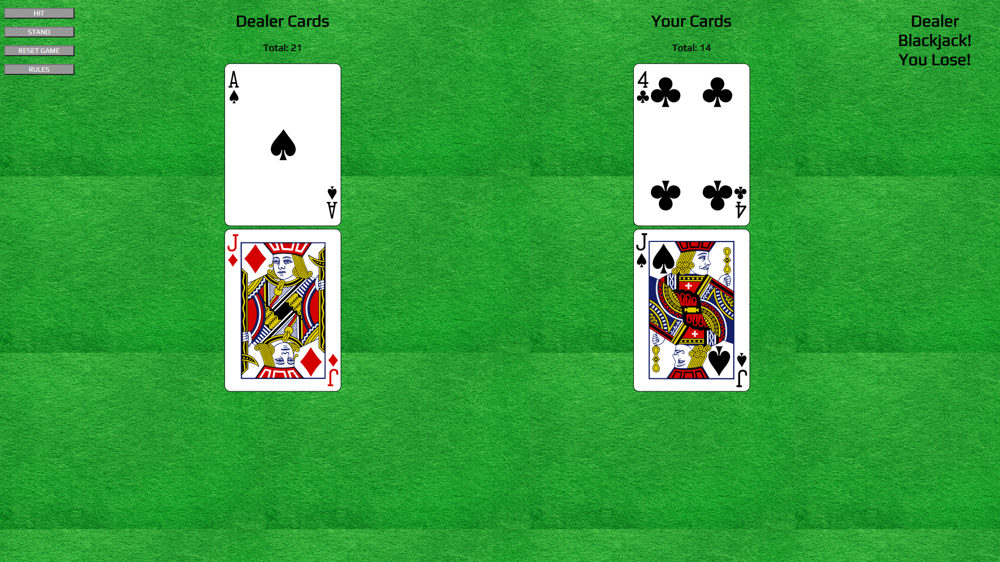

# BlackJack

Blackjack Javascript Game

## Date: 8/8/2021

### By: Max Arenstein

[Facebook](https://www.facebook.com/max.arenstein/) | [Twitter](https://twitter.com/MisterMindX) | [Github](https://github.com/MistermindX)

---

**_Description_**

This is a Blackjack game designed with Javascript. Get the highest number without going over 21.

---

**_Technologies Used_**

- HTML
- CSS
- Javascript
- Surge

---

**_Getting Started_**

Game start on load. The player is dealt two cards face up and the dealer is dealt one face up and one face down. Hit to draw a card for your pile. Stand to have the dealer play. Click rules to see the rules of the game.
A Trello was used to keep track of development progress and can be viewed [here](https://trello.com/b/N5eI33rH/blackjack-game).

The game was deployed on Surge and can be viewed [here](https://card-blackjack.surge.sh/)

---

**_Screenshots_**

### Game with normal Wincon

### Game with Blackjack Outcome

### Game on Mobile

**_Future Updates_**

- [ ] Betting
- [ ] Reset without reload

---

**_Credits_**

- [Deck of Cards API](https://deckofcardsapi.com/)
